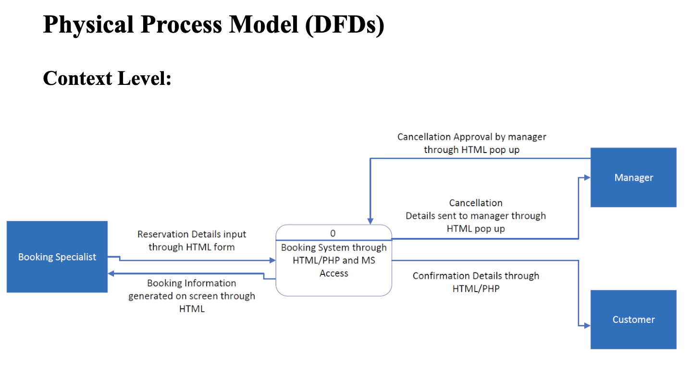
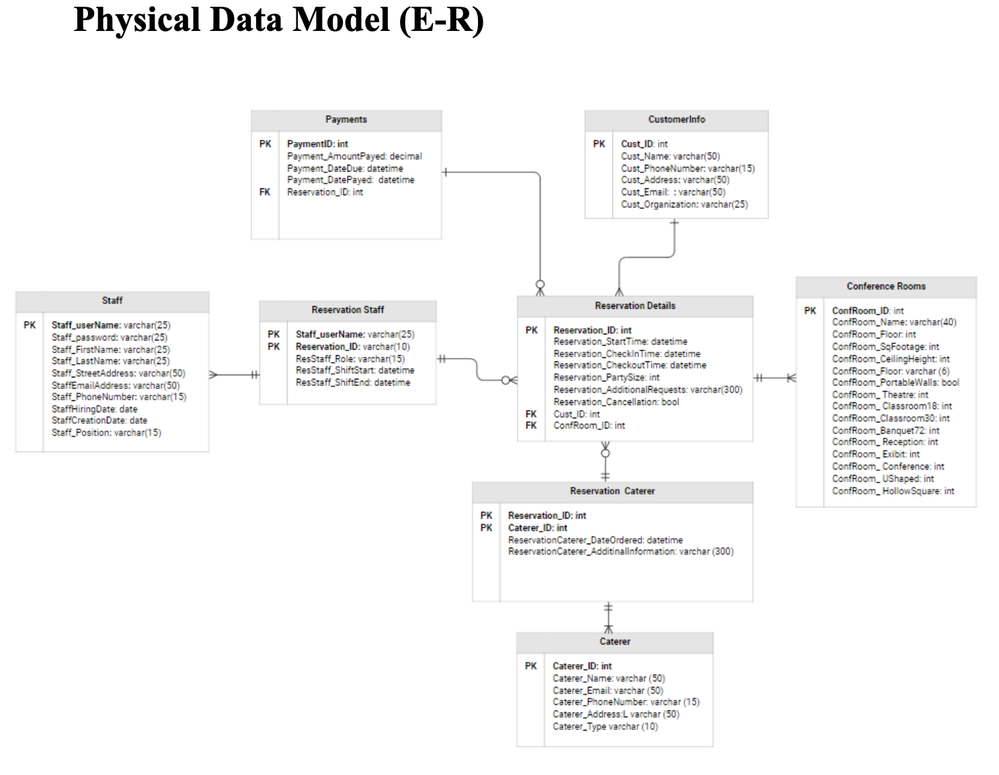

# hotel-conference-room-booking-system
**Hotel Conference Room Booking System (Systems Analysis Case Study)**

This project proposes the design of an internal conference room booking system for a mid-sized hotel. The goal is to replace manual and error-prone reservation processes with a structured, user-friendly system that improves operational efficiency, reduces booking errors, and increases revenue from conference room utilization.

The project follows the Systems Development Life Cycle (SDLC) and focuses on requirements gathering, feasibility analysis, system modeling, and solution design rather than software implementation.

---

## Overview

The system was designed as an internal reservation and management tool used by hotel booking specialists and managers. It supports creating, modifying, and canceling conference room reservations while securely managing customer data and tracking availability, payments, and room performance.

The design emphasizes accuracy, scalability, and usability while integrating with existing hotel operations.

The final system proposal can be viewed here: [Final Hotel Booking System (PDF)](final-hotel-conference-booking-system.pdf)

---

## System Objectives

- Automate conference room reservation workflows  
- Reduce manual paperwork and booking errors  
- Improve response time to customer requests  
- Support multiple simultaneous users  
- Provide structured data for operational and revenue analysis  

---

## Key System Components

**Reservation Management**  
Handles the creation, modification, and cancellation of conference room reservations.

**Customer Accounts**  
Stores customer contact information and reservation history.

**Availability Tracking**  
Ensures accurate real-time tracking of conference room availability.

**Manager Oversight**  
Requires managerial acknowledgment for reservation changes or cancellations.

**Reporting and Data Storage**  
Supports long-term data storage for revenue tracking and performance analysis.

---

## Use Cases

- Create Customer Account  
- Create Conference Room Reservation  
- Modify Reservation  
- Cancel Reservation  

Each use case includes defined actors, triggers, preconditions, postconditions, and exception handling.

---

## Process and Data Modeling

**Data Flow Diagrams (DFDs)**  
- Context-level diagram showing system boundaries  
- Level 0 and Level 1 diagrams detailing reservation, customer, and reporting processes  

**Entity Relationship Diagram (ERD)**  
- Models relationships between customers, reservations, conference rooms, and related entities  
- Defines primary and foreign key relationships for structured data storage  

  

---

## Feasibility Analysis

**Technical Feasibility**  
Designed to operate on Microsoft Windows environments using familiar enterprise tools, minimizing technical risk and training requirements.

**Economic Feasibility**  
The system adheres to a $40,000 budget constraint and projects a positive ROI through increased conference room revenue and improved operational efficiency.

**Organizational Feasibility**  
The system aligns with existing hotel workflows and includes management involvement to support adoption and training.

---

## Hardware and Software Environment

- Microsoft Windows (Client and Server)  
- SQL Server  
- Microsoft Office Professional  
- Enterprise security and network infrastructure  

---

## Deliverables Included

- System Request and Business Requirements  
- SDLC Project Work Plan  
- Feasibility Analysis  
- Requirements Definition Document  
- Use Case Specifications  
- Data Flow Diagrams (DFDs)
- Entity Relationship Diagram (ERD)
- User Interface Mockups  
  
---

## Tools and Skills

- Systems Analysis and Design  
- SDLC Methodology  
- Requirements Gathering  
- Data Flow Modeling (DFDs)  
- Entity Relationship Modeling (ERD)  
- Feasibility and Cost-Benefit Analysis  
- Business Process Optimization  

---

## Reflection

This project strengthened my ability to analyze business processes and translate operational needs into structured system designs. It reinforced the importance of clear requirements, stakeholder communication, and feasibility evaluation when proposing enterprise software solutions. The project also deepened my understanding of how systems design supports data-driven decision making and long-term scalability.
